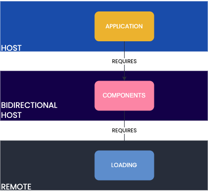

# React Module federation example

Module federation with three packages, managed using `npm` workspaces.

Three packages:



1. `application` - Host. Composes the 2 packages below.
2. `components` - Bidirectional host. Imports the loading component, applies CSS and then re-exposes it. Also, exposes a rounded button.
3. `loading` - Remote. Exposes a loading component.

## Local dev

```
npm i
npm start
```
